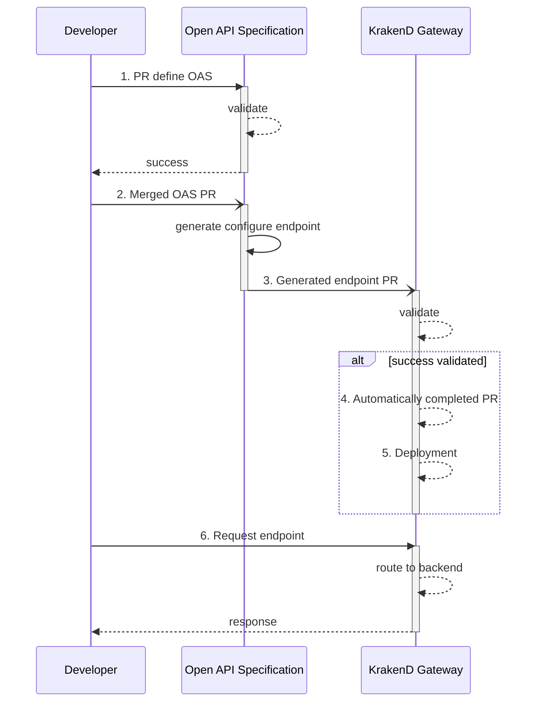

# OAS KrakendD Automatically Reigster Endpoint

## Communication Flow

```mermaid
sequenceDiagram
    participant DEV as Developer
    participant OAS as Open API Specification
    participant GW as KrakenD Gateway
    
    DEV->>OAS: 1. PR define OAS
    activate OAS
    OAS-->>OAS: validate
    OAS-->>DEV: success
    deactivate OAS

    DEV-)OAS: 2. Merged OAS PR
    activate OAS
    OAS->>OAS: generate configure endpoint
    OAS-)GW: 3. Generated endpoint PR
    deactivate OAS
    activate GW
    GW-->>GW: validate
    alt success validated
    GW-->>GW: 4. Automatically completed PR
    GW-->>GW: 5. Deployment
    end
    deactivate GW
    
    DEV->>GW: 6. Request endpoint
    activate GW
    GW-->>GW: route to backend
    GW-->>DEV: response
    deactivate GW
```
